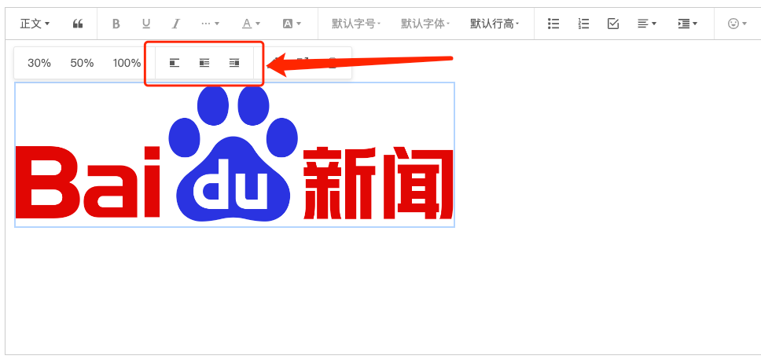
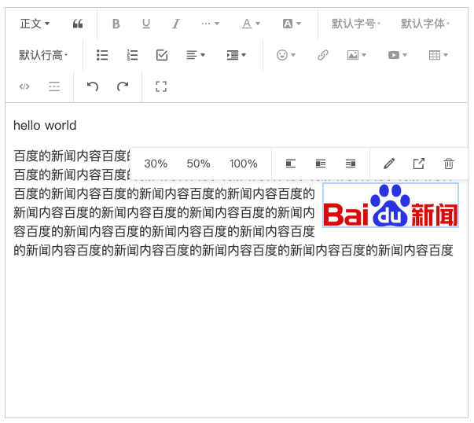

# [wangEditor-next](https://wangeditor-next.github.io/docs/en/) float-image plugin

[中文文档](./README.md)

<br/>
<br/>
<a href="https://github.com/hqwlkj/wangEditor-plugin-float-image/releases">

</a>
<a href="https://www.npmjs.com/package/wangeditor-plugin-float-image">

</a>

## Introduction

[wangEditor-next](https://wangeditor-next.github.io/docs/en/) float-image plugin.




## Installation

```shell
yarn add wangeditor-plugin-float-image
```
or

```shell
npm i wangeditor-plugin-float-image
```

## Usage

### Register to editor

```js
import { Boot } from '@wangeditor-next/editor'
import floatImageModule from 'wangeditor-plugin-float-image'

// Register
// You should register this before create editor, and register only once (not repeatedly).
Boot.registerModule(floatImageModule)
```

### Configuration

Editor config

```ts
import { IEditorConfig } from '@wangeditor-next/editor'

const editorConfig: Partial<IEditorConfig> = {
  hoverbarKeys: {
    // hover menus when selected link text
    link: {
      menuKeys: [ // Get default config by `editor.getConfig().hoverbarKeys.image`
        'imageWidth30',
        'imageWidth50',
        'imageWidth100',
        '|',
        'imageFloatNone', // add 'Convert to float-image' menu
        'imageFloatLeft',
        'imageFloatRight',
        '|',
        'editImage',
        'viewImageLink',
        'deleteImage',
      ],
    },
  },

  // others...
}
```

Then create editor and toolbar, you will use `editorConfig`.

### Render HTML

You will get a float-image HTML format like this

```html
<div class="w-e-image-container" style="width: 30%;">
  
</div>
```

## Others

Support i18n.


## LICENSE

[MIT](https://github.com/hqwlkj/wangEditor-plugin-float-image/blob/master/LICENSE)
