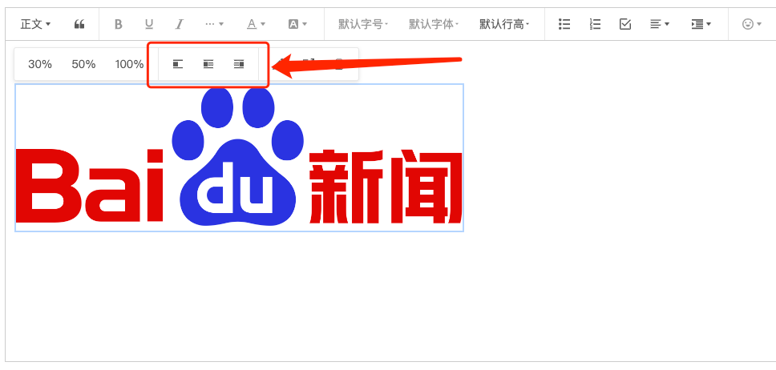
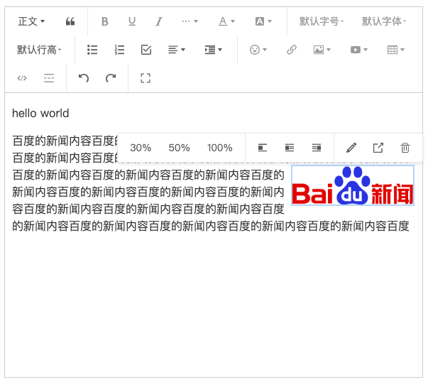

# [wangEditor-next](https://wangeditor-next.github.io/docs/) 图片浮动 插件

[English Documentation](./README-en.md)

<br/>
<br/>
<a href="https://github.com/hqwlkj/wangEditor-plugin-float-image/releases">

</a>
<a href="https://www.npmjs.com/package/wangeditor-plugin-float-image">

</a>

## 介绍

[wangEditor-next](https://wangeditor-next.github.io/docs/) 图片浮动 插件。




## 安装

```shell
yarn add @wangeditor-next/plugin-float-image
```
或者

```shell
npm i @wangeditor-next/plugin-float-image
```

## 使用

### 注册到编辑器

```js
import { Boot } from '@wangeditor-next/editor'
import floatImageModule from 'wangeditor-plugin-float-image'

// 注册。要在创建编辑器之前注册，且只能注册一次，不可重复注册。
Boot.registerModule(floatImageModule)
```

### 配置

编辑器配置

```ts
import { IEditorConfig } from '@wangeditor-next/editor'

const editorConfig: Partial<IEditorConfig> = {
  hoverbarKeys: {
    // 在编辑器中，选中链接文本时，要弹出的菜单
    link: {
      menuKeys: [ // 默认的配置可以通过 `editor.getConfig().hoverbarKeys.image` 获取
        'imageWidth30',
        'imageWidth50',
        'imageWidth100',
        '|',               // 分割符
        'imageFloatNone',  // 增加 '图片浮动' 菜单
        'imageFloatLeft',
        'imageFloatRight',
        '|',               // 分割符
        'editImage',
        'viewImageLink',
        'deleteImage',
      ],
    },
  },

  // 其他配置...
}
```

然后创建编辑器和工具栏，会用到 `editorConfig` 。具体查看 wangEditor 文档。

### 显示 HTML

一个 float-image 节点产出的 HTML 格式如下

```html
<div class="w-e-image-container" style="width: 30%;">
  
</div>
```

## 其他

支持 i18n 多语言


## 许可证

[MIT](https://github.com/hqwlkj/wangEditor-plugin-float-image/blob/master/LICENSE)
