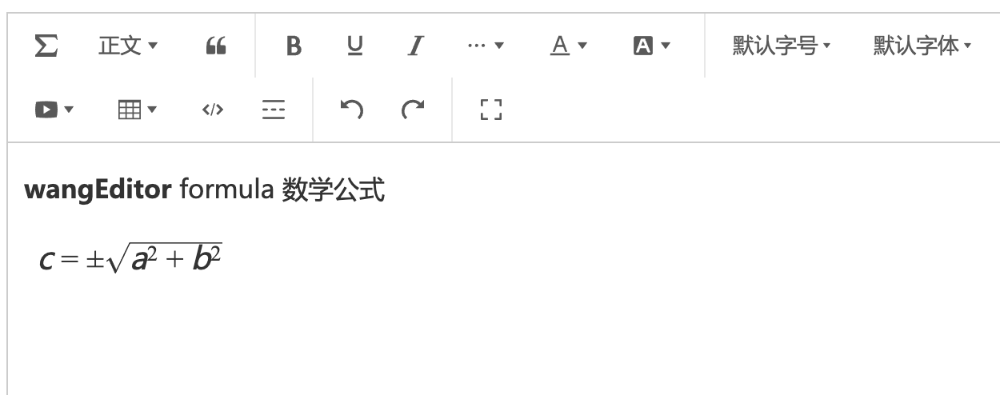

# wangEditor formula module

[中文文档](./README.md)

## Introduction

[wangEditor-next](https://cycleccc.github.io/docs/en/) Formula plugin, use `LateX` syntax.



## Installation

```shell
yarn add katex
yarn add @wangeditor-next/plugin-formula
```

## Usage

### Register to editor


```js
import { Boot, IEditorConfig, IToolbarConfig } from '@wangeditor-next/editor'
import formulaModule from '@wangeditor-next/plugin-formula'

// Register
// You should register this before create editor, and register only once (not repeatedly).
Boot.registerModule(formulaModule)
```

### Menu config

```js
const editorConfig: Partial<IEditorConfig> = {
  // Hoverbar keys when selected a formula node.
  hoverbarKeys: {
    formula: {
      menuKeys: ['editFormula'], // “编辑公式”菜单
    },
  },

  // others...
}

const toolbarConfig: Partial<IToolbarConfig> = {
  insertKeys: {
    index: 0,
    keys: [
      'insertFormula', // Insert formula menu
      // 'editFormula' // Edit formula menu
    ],
  },

  // others...
}
```

Then create editor and toolbar, you will use `editorConfig` and `toolbarConfig`

### Render HTML

You will get a formula's HTML format like this

```html
<span data-w-e-type="formula" data-w-e-is-void data-w-e-is-inline data-value="c = \\pm\\sqrt{a^2 + b^2}"></span>
```

Dateset `data-value` is the `LateX` syntax value, you can use a third-party lib to render formula card, like [KateX](https://katex.org/).

## Others

Support i18n.
