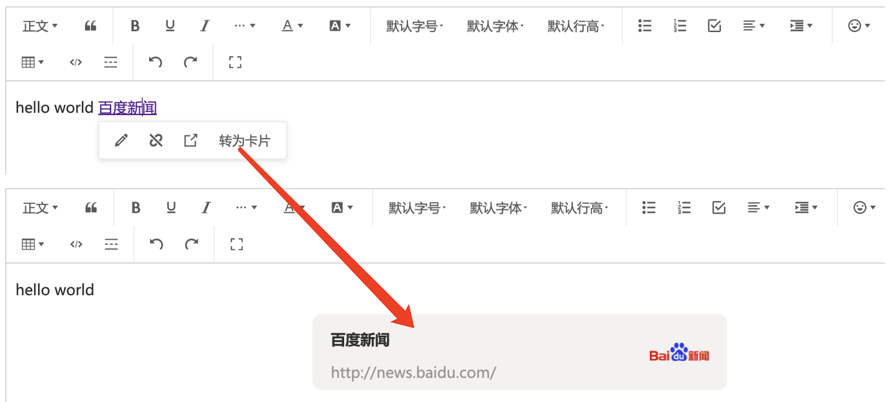

# wangEditor link-card plugin

[中文文档](./README.md)

## Introduction

[wangEditor-next](https://wangeditor-next.github.io/docs/) link-card plugin.



## Installation

```shell
yarn add @wangeditor-next/plugin-link-card
```

## Usage

### Register to editor

```js
import { Boot } from '@wangeditor-next/editor'
import linkCardModule from '@wangeditor-next/plugin-link-card'

// Register
// You should register this before create editor, and register only once (not repeatedly).
Boot.registerModule(linkCardModule)
```

### Configuration

Editor config

```ts
import { IEditorConfig } from '@wangeditor-next/editor'

const editorConfig: Partial<IEditorConfig> = {
  hoverbarKeys: {
    // hover menus when selected link text
    link: {
      menuKeys: [
        'editLink', 'unLink', 'viewLink', // Get default config by `editor.getConfig().hoverbarKeys.link`
        'convertToLinkCard' // add 'Convert to link-card' menu
      ],
    },
  },

  MENU_CONF: {
    convertToLinkCard: {
      // Custom get link-card info.
      // return { title, iconImgSrc }
      async getLinkCardInfo(linkText: string, linkUrl: string) {
        // 1. Create a <iframe> and load the page, then get title and icon of this page.
        // 2. Get info by server (Some pages set `X-Frame-Options`, cannot loaded by cross-origin <iframe>)

        // // Simulate async return
        // return new Promise(resolve => {
        //   setTimeout(() => {
        //     const info = { title: linkText, iconImgSrc: '' }
        //     resolve(info)
        //   }, 100)
        // })
      }
    },

    // other menu config...
  },

  // others...
}
```

Then create editor and toolbar, you will use `editorConfig`.

### Render HTML

You will get a link-card's HTML format like this

```html
<div data-w-e-type="link-card" data-w-e-is-void data-title="Baidu News" data-link="http://news.baidu.com/"
  data-iconImgSrc="https://news-bos.cdn.bcebos.com/mvideo/log-news.png">
  <div class="info-container">
    <div class="title-container">
      <p>Baidu News</p>
    </div>
    <div class="link-container"><span>http://news.baidu.com/</span></div>
  </div>
  <div class="icon-container">
    
  </div>
</div>
```

You need custom CSS styles like this

```css
div[data-w-e-type="link-card"] {
  width: 450px;
  margin: 0 auto;
  background-color: #f1f1f1;
  border-radius: 10px;
  display: flex;
  padding: 10px 20px;
  cursor: pointer;
}
div[data-w-e-type="link-card"] .info-container {
  flex: 1;
  padding-right: 20px;
}
div[data-w-e-type="link-card"] .info-container p {
  margin-top: 5px;
  font-weight: bold;
}
div[data-w-e-type="link-card"] .info-container span {
  opacity: .5;
}
div[data-w-e-type="link-card"] .icon-container {
  width: 64px;
  overflow: hidden;
}
div[data-w-e-type="link-card"] .icon-container img {
  width: 100%;
  height: 100%;
  object-fit: contain;
}
```

## Others

Support i18n.
