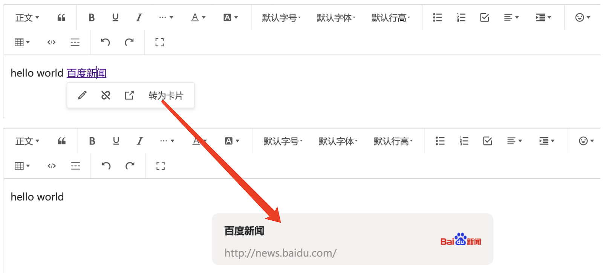

# wangEditor 链接卡片 插件

[English Documentation](./README-en.md)

## 介绍

[wangEditor-next](https://wangeditor-next.github.io/docs/) 链接卡片 插件。



## 安装

```shell
yarn add @wangeditor-next/plugin-link-card
```

## 使用

### 注册到编辑器

```js
import { Boot } from '@wangeditor-next/editor'
import linkCardModule from '@wangeditor-next/plugin-link-card'

// 注册。要在创建编辑器之前注册，且只能注册一次，不可重复注册。
Boot.registerModule(linkCardModule)
```

### 配置

编辑器配置

```ts
import { IEditorConfig } from '@wangeditor-next/editor'

const editorConfig: Partial<IEditorConfig> = {
  hoverbarKeys: {
    // 在编辑器中，选中链接文本时，要弹出的菜单
    link: {
      menuKeys: [
        'editLink', 'unLink', 'viewLink', // 默认的配置可以通过 `editor.getConfig().hoverbarKeys.link` 获取
        'convertToLinkCard' // 增加 '转为链接卡片'菜单
      ],
    },
  },

  MENU_CONF: {
    // '转为链接卡片'菜单的配置
    convertToLinkCard: {
      // 自定义获取 link-card 信息，可选
      // 返回 { title, iconImgSrc }
      async getLinkCardInfo(linkText: string, linkUrl: string) {
        // 1. 可通过 iframe 加载网页，然后获取网页 title 和其中的图片
        // 2. 服务端获取（有些网页会设置 `X-Frame-Options` ，无法通过 iframe 加载）

        // // 模拟异步返回
        // return new Promise(resolve => {
        //   setTimeout(() => {
        //     const info = { title: linkText, iconImgSrc: '' }
        //     resolve(info)
        //   }, 100)
        // })
      }
    },

    // 其他...
  },

  // 其他...
}
```

然后创建编辑器和工具栏，会用到 `editorConfig` 。具体查看 wangEditor 文档。

### 显示 HTML

一个 link-card 节点产出的 HTML 格式如下

```html
<div data-w-e-type="link-card" data-w-e-is-void data-title="百度新闻" data-link="http://news.baidu.com/"
  data-iconImgSrc="https://news-bos.cdn.bcebos.com/mvideo/log-news.png">
  <div class="info-container">
    <div class="title-container">
      <p>百度新闻</p>
    </div>
    <div class="link-container"><span>http://news.baidu.com/</span></div>
  </div>
  <div class="icon-container">
    
  </div>
</div>
```

渲染这段 HTML 需要自己定义 CSS 样式，可参考

```css
div[data-w-e-type="link-card"] {
  width: 450px;
  margin: 0 auto;
  background-color: #f1f1f1;
  border-radius: 10px;
  display: flex;
  padding: 10px 20px;
  cursor: pointer;
}
div[data-w-e-type="link-card"] .info-container {
  flex: 1;
  padding-right: 20px;
}
div[data-w-e-type="link-card"] .info-container p {
  margin-top: 5px;
  font-weight: bold;
}
div[data-w-e-type="link-card"] .info-container span {
  opacity: .5;
}
div[data-w-e-type="link-card"] .icon-container {
  width: 64px;
  overflow: hidden;
}
div[data-w-e-type="link-card"] .icon-container img {
  width: 100%;
  height: 100%;
  object-fit: contain;
}
```

## 其他

支持 i18n 多语言

